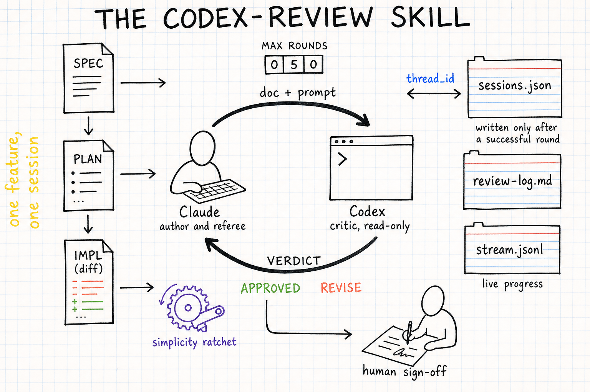
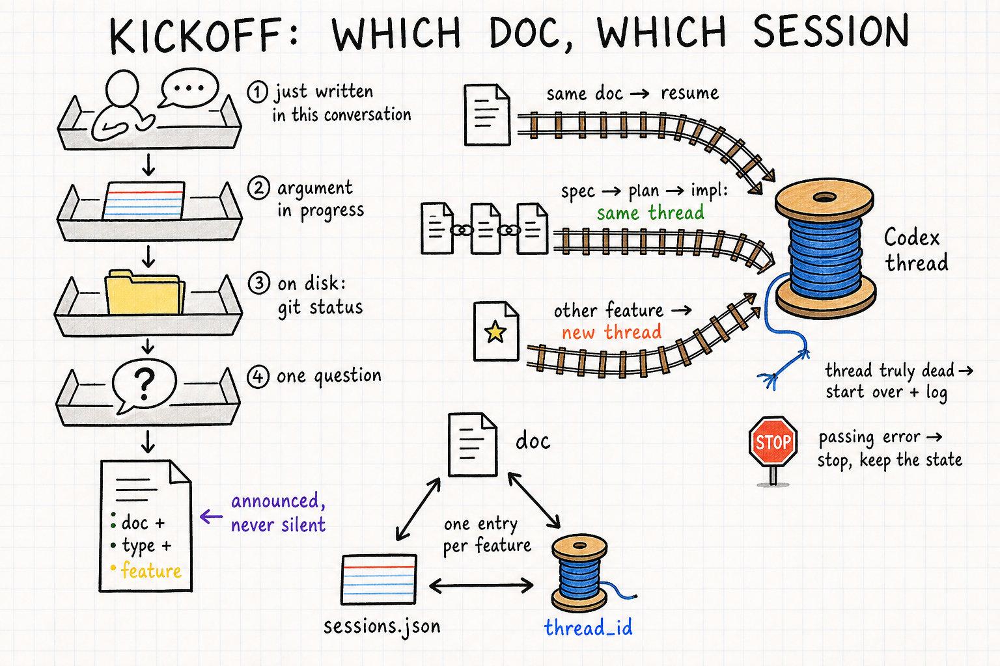
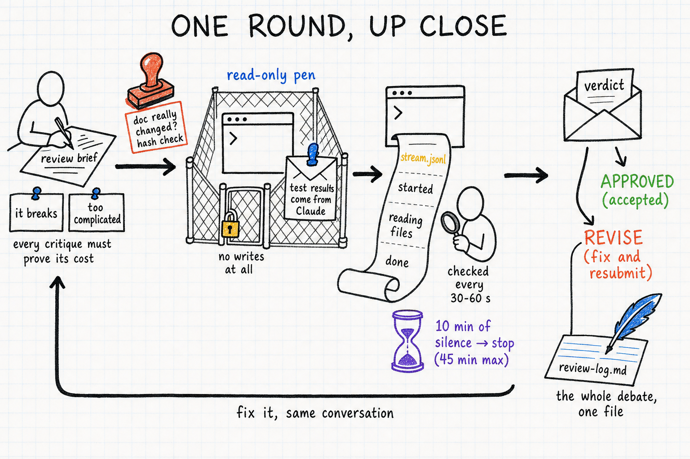
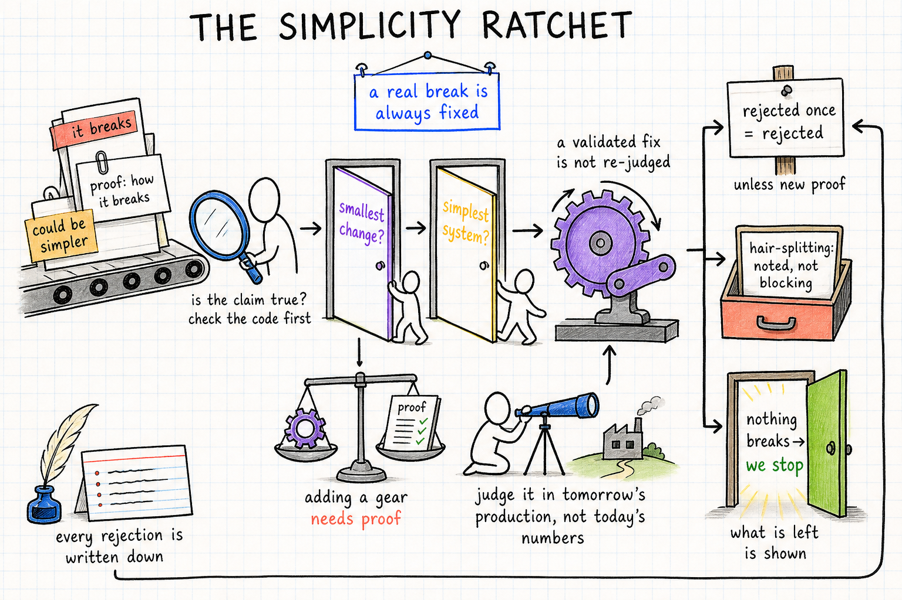

# claude-skills

Skills Claude Code personnelles. Une seule pour l'instant : **codex-review**. English version: [README.md](README.md).

## codex-review — la boucle de review adversariale

Deux modèles, un document, une dispute bornée. Claude écrit (spec, plan, puis code) et arbitre ; OpenAI Codex critique en lecture seule, round après round, jusqu'à `VERDICT: APPROVED` ou le plafond de rounds. La conversation avec le critique survit d'une invocation à l'autre : on corrige le document demain, on relance, le reviewer reprend avec toutes ses critiques en tête au lieu de tout redécouvrir.

La skill s'utilise après un brainstorming/plan superpowers (`/codex-review` sans argument trouve le document tout seul) et couvre trois étages d'une même feature : la **spec**, le **plan**, puis l'**implémentation** (le diff relu contre le plan, idéalement avant commit).

Quatre schémas racontent le fonctionnement, du survol au détail. Ils sont lettrés en anglais.

### Niveau 1 — l'architecture



Tout y est, de gauche à droite :

- **La colonne des trois étages.** Spec, plan, implémentation (le diff). Une feature descend ces trois marches, et l'annotation le dit : *one feature, one session*. Le même fil Codex accompagne les trois étages, si bien que le reviewer qui a attaqué la spec puis le plan finit par juger le code en connaissance de cause.
- **La boucle centrale.** Claude (auteur et arbitre) envoie *doc + prompt* ; Codex (un terminal, critique en lecture seule) renvoie un *VERDICT* : `APPROVED` ou `REVISE`. Le compteur *MAX ROUNDS* borne la dispute. Elle se termine toujours.
- **Le cliquet de simplicité** sur le chemin du retour : chaque correction acceptée passe ce filtre avant de toucher le document (détaillé planche 4).
- **L'état persistant**, à droite : `sessions.json` (le fil Codex de chaque feature, relié par son *thread_id* et *écrit seulement après un round réussi*, jamais au lancement), `review-log.md` (tout le débat, verbatim) et `stream.jsonl` (la progression en direct pendant qu'un round tourne).
- **La signature humaine**, en bas : rien ne s'implémente sans le oui final de l'utilisateur.

### Niveau 2a — le kickoff : quel doc, quelle session



Ce qui se passe avant le premier round.

À gauche, **l'entonnoir à quatre plateaux** : invoquée sans argument, la skill devine le document en essayant quatre sources dans l'ordre : ① le document qu'on vient d'écrire dans la conversation, ② un argument en cours dans `sessions.json`, ③ le disque (`git status`, le doc le plus récent), ④ sinon une seule question. Le résultat (*doc + type + feature*) est toujours annoncé, jamais silencieux : l'utilisateur peut corriger avant de brûler un round.

À droite, **les trois rails vers la bobine** (le fil Codex) : même doc → on reprend le fil ; spec → plan → impl d'une même feature → toujours le même fil ; autre feature → fil neuf. Le fil cassé se traite avec prudence : seul un fil *définitivement mort* justifie de repartir (consigné dans le log) ; une *erreur passagère* (authentification, modèle, timeout) arrête le run sans toucher l'état.

En bas, **le triangle de couplage** : le document, `sessions.json` et le *thread_id* se tiennent. Une entrée par feature, pas de doublon.

### Niveau 2b — un round, concrètement



L'anatomie d'un aller-retour.

1. **La consigne.** Claude écrit le prompt de review, qui impose la discipline des critiques : chaque trouvaille est étiquetée *ça casse* (avec le scénario de casse) ou *trop compliqué*. Chaque critique doit prouver son coût. Avant que la consigne parte, un tampon demande *le doc a-t-il vraiment changé ?* : le hash du document est comparé à celui du round précédent, et un document inchangé n'est jamais resoumis (deux rounds réels ont été brûlés ainsi après l'échec d'un script d'édition).
2. **L'enclos en lecture seule.** Codex travaille enfermé : son shell et ses accès fichiers ne peuvent rien écrire, répertoires temporaires compris. C'est aussi pour cela qu'il ne peut pas lancer la suite de tests lui-même. En mode implémentation, *les résultats de tests viennent de Claude*, collés dans le prompt.
3. **Le ticker.** L'activité sort en continu sur `stream.jsonl` (démarré, il lit les fichiers, terminé), regardée toutes les 30-60 s. Le garde est un garde d'inactivité, pas une horloge murale : *10 minutes de silence* sur le stream arrêtent le round, avec un plafond dur de 45 minutes. Les premiers rounds réels sur un gros document durent 14 à 18 minutes.
4. **Le verdict.** `APPROVED (accepté)` ou `REVISE (corriger et resoumettre)`. Sur REVISE, Claude corrige et repart, même conversation. Tout le débat s'accumule dans `review-log.md`, un fichier par feature.

### Niveau 2c — le cliquet de simplicité



Le garde-fou contre la sur-ingénierie, appliqué par Claude à chaque REVISE.

Les critiques arrivent sur le convoyeur. Premier arrêt, la loupe : *la critique est-elle vraie ? vérifier le code d'abord*. Une critique formulée concrètement peut être fausse, et une prémisse démontée est rejetée preuve à l'appui. Chaque correction candidate passe ensuite **deux portes** : *changement minimal ?* (est-ce la plus petite modification qui résout la casse ?) et *système le plus simple ?* (la correction laisse-t-elle la machine avec autant ou moins de rouages ?). La balance en dessous fixe la règle : *ajouter un rouage exige une preuve*. Pas de mécanisme spéculatif.

La longue-vue sur l'horizon fixe l'étalon : *juger dans la production de demain, pas avec les chiffres d'aujourd'hui*. En phase de développement la population touchée est vide par construction, donc « zéro utilisateur concerné aujourd'hui » n'est jamais une raison de rejeter ou de réduire un fix. La review protège l'état qui sera livré.

La pancarte borne le filtre lui-même : *une vraie casse est toujours corrigée*. Le cliquet gouverne la forme de la correction, jamais l'existence d'un vrai bug. La roue à cliquet ne tourne que dans un sens : *une correction validée ne se rejuge pas*. Et les trois sorties tuent la boucle infinie : *rejeté une fois = rejeté* (sauf preuve nouvelle), *couper les cheveux en quatre : noté, pas bloquant*, et *plus rien ne casse → on s'arrête*. On présente ce qui reste plutôt que de polir sans fin. Chaque refus est écrit.

## Regénérer les planches

Les planches sont dessinées par `gpt-image-2` (OpenRouter, `POST /api/v1/images`, ratio 3:2, 2K). Chaque `codex-review/architecture*-body.txt` contient le scénario exact ; on lui concatène `codex-review/STYLE.txt` pour obtenir le prompt complet. Générer la planche architecture d'abord, puis la passer en `input_references` pour les trois autres afin que la même main dessine les quatre. Vérifier le lettrage de chaque planche : environ une sur quatre oublie ou déforme un libellé et demande un second tirage. Coût de $0,05 à $0,18 par planche.

## Installation

```bash
git clone git@github.com:darksip/claude-skills.git
ln -s "$PWD/claude-skills/codex-review" ~/.claude/skills/codex-review
```

Usage : `/codex-review` (inférence automatique), ou avec arguments : `feature=<slug>`, `type=spec|plan|impl`, `rounds=<n>`, `reasoning=low|medium|high|xhigh|max`, `fresh=1`. Prérequis : `codex` CLI ≥ 0.130, authentifié (`codex login`). Le contrat complet est dans [codex-review/SKILL.md](codex-review/SKILL.md).
